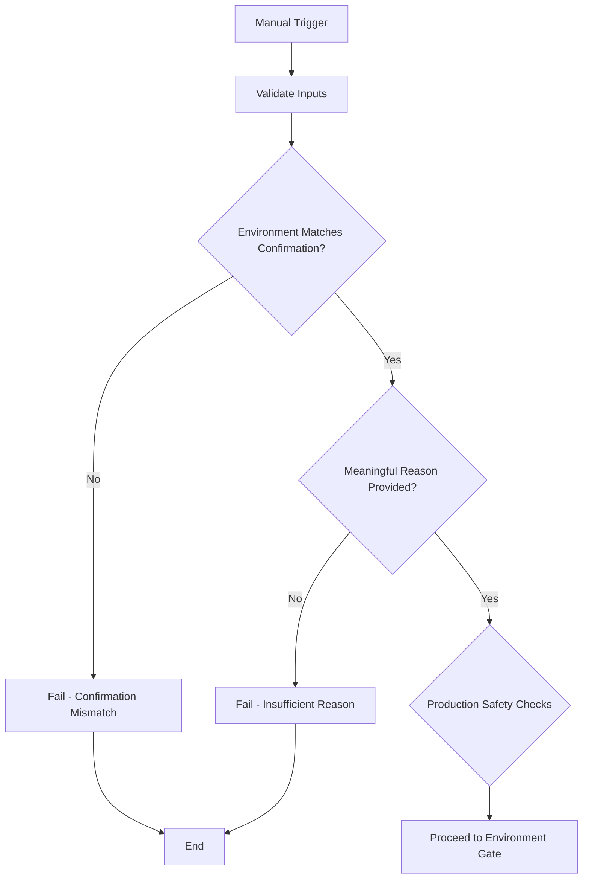
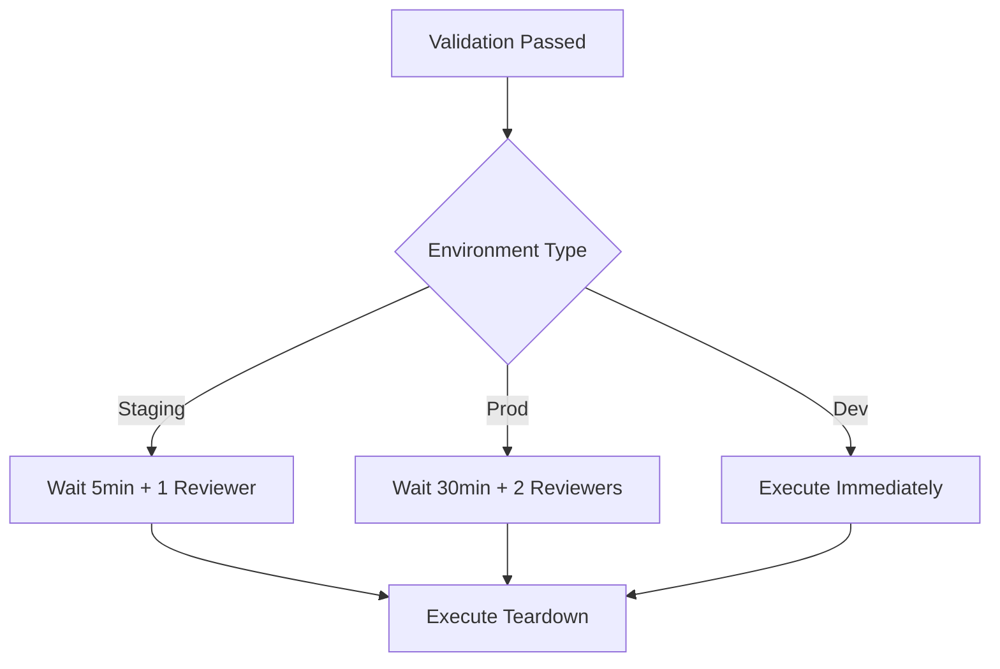
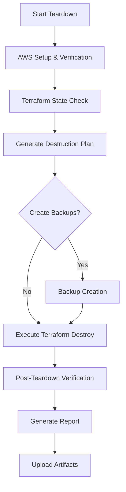

# CI/CD Teardown Integration Guide for GAMCAPP

This guide explains how to safely incorporate infrastructure teardown into your GitHub Actions CI/CD pipeline with comprehensive safety measures and automation features.

## 🎯 Overview

The CI/CD teardown integration provides:
- **Manual Dispatch Workflow** for controlled infrastructure destruction
- **Automatic Maintenance** for resource cleanup (EIPs, unused resources)  
- **Environment Protection** with multi-stage approvals
- **Comprehensive Logging** and artifact retention
- **Safety Features** to prevent accidental destruction

## 📁 Workflow Files

### 1. Main Teardown Workflow (`.github/workflows/teardown.yml`)

**Purpose**: Manual infrastructure teardown with extensive safety measures

**Features**:
- ✅ Manual dispatch only (no automatic triggers)
- ✅ Multiple confirmation inputs required
- ✅ Environment-specific validation
- ✅ Automatic backup creation
- ✅ S3 data preservation options
- ✅ Comprehensive logging and reporting
- ✅ 30-day artifact retention

**Trigger**: Manual only via GitHub Actions UI

### 2. Maintenance Workflow (`.github/workflows/maintenance.yml`)

**Purpose**: Automatic resource cleanup and verification

**Features**:
- ✅ Runs after successful deployments (dev only)
- ✅ EIP cleanup to prevent limit issues
- ✅ Infrastructure verification
- ✅ Emergency cleanup (dry-run only)
- ✅ Minimal permissions required

**Triggers**: 
- After successful dev deployments
- Manual dispatch for any environment

## 🛡️ Security Configuration

### GitHub Environment Protection Rules

Set up environment protection in GitHub Repository Settings → Environments:

#### Development Environment
```yaml
Environment: development
Protection Rules:
  - Required reviewers: None
  - Wait timer: None
  - Restrict pushes: No
```

#### Staging Environment  
```yaml
Environment: staging
Protection Rules:
  - Required reviewers: 1 team member
  - Wait timer: 5 minutes
  - Restrict pushes: Protected branches only
```

#### Production Environment
```yaml
Environment: production
Protection Rules:
  - Required reviewers: 2+ senior team members
  - Wait timer: 30 minutes  
  - Restrict pushes: Protected branches only
  - Required status checks: All CI/CD tests must pass
```

### Required Repository Secrets

Add these secrets in GitHub Repository Settings → Secrets:

```bash
# Environment-specific database passwords
DEV_DB_PASSWORD=your_dev_db_password
STAGING_DB_PASSWORD=your_staging_db_password  
PROD_DB_PASSWORD=your_prod_db_password

# Optional: Notification webhooks
SLACK_WEBHOOK_URL=https://hooks.slack.com/services/...
TEAMS_WEBHOOK_URL=https://outlook.office.com/webhook/...
```

## 🚀 Using the Teardown Workflow

### Step 1: Navigate to GitHub Actions
1. Go to your repository on GitHub
2. Click the "Actions" tab
3. Select "Infrastructure Teardown" workflow

### Step 2: Manual Dispatch
1. Click "Run workflow" button
2. Select the branch (usually `main`)
3. Fill in the required inputs:
   - **Environment**: Choose dev, staging, or prod
   - **Confirm Environment**: Type the environment name again
   - **Create Backups**: Always recommended (especially for prod)
   - **Skip RDS Snapshot**: Only for dev (faster but data loss)
   - **Download S3 Data**: Recommended for important data
   - **Reason**: Provide meaningful reason for audit trail

### Step 3: Review and Approve
- **Development**: Runs immediately
- **Staging**: Requires 1 reviewer + 5-minute wait
- **Production**: Requires 2+ reviewers + 30-minute wait

### Step 4: Monitor Execution
- Watch the workflow progress in real-time
- Review logs for any issues
- Download artifacts if needed (logs, backups)

## ⚙️ Workflow Input Parameters

### Environment Selection
```yaml
environment:
  description: 'Environment to teardown'
  type: choice
  options: [dev, staging, prod]
```

### Safety Confirmations
```yaml
confirm_environment:
  description: 'Type environment name again to confirm'
  type: string
  required: true
```

### Data Preservation Options
```yaml
create_backups:
  description: 'Create backups before teardown?'
  default: true
  type: boolean

skip_rds_snapshot:
  description: 'Skip RDS final snapshot?'
  default: false  # Always create snapshots by default
  type: boolean

download_s3_data:
  description: 'Download S3 bucket contents?'
  default: true
  type: boolean
```

### Audit Trail
```yaml
reason:
  description: 'Reason for teardown (for audit trail)'
  type: string
  required: true
```

## 📊 Workflow Execution Flow

### Validation Stage


### Environment Protection Gate


### Teardown Execution


## 🔧 Maintenance Workflow Usage

### Automatic Triggers
The maintenance workflow automatically runs after successful dev deployments to:
- Clean up unused Elastic IP addresses
- Prevent EIP limit issues
- Maintain optimal resource utilization

### Manual Maintenance
You can also trigger maintenance manually:
1. Go to "Infrastructure Maintenance" workflow
2. Click "Run workflow"
3. Select environment and cleanup type:
   - **EIPs Only**: Clean up unused Elastic IPs
   - **Full Verification**: Complete infrastructure check
   - **Emergency Cleanup**: Dry-run of emergency procedures

## 📋 Best Practices

### Before Running Teardown
1. **Verify Environment**: Double-check you're targeting the correct environment
2. **Check Dependencies**: Ensure no other systems depend on this infrastructure
3. **Backup Critical Data**: Always enable backups for production
4. **Communicate**: Notify team members of planned teardown
5. **Schedule Appropriately**: Consider business hours and user impact

### During Teardown
1. **Monitor Progress**: Watch the workflow execution
2. **Stay Available**: Be ready to intervene if issues arise
3. **Check Logs**: Review output for any warnings or errors
4. **Verify Artifacts**: Ensure backups and logs are created

### After Teardown
1. **Verify Completion**: Check AWS Console for remaining resources
2. **Review Billing**: Monitor for unexpected charges
3. **Update Documentation**: Remove references to destroyed infrastructure
4. **Clean Up**: Remove backup files when no longer needed
5. **Post-Mortem**: Document lessons learned

## 🚨 Emergency Procedures

### If Teardown Fails
1. **Check Logs**: Review workflow logs for specific errors
2. **AWS Console**: Verify current state of resources
3. **Manual Intervention**: Use emergency cleanup workflow
4. **Support**: Contact AWS support for stuck resources

### If Teardown Hangs
1. **Wait**: Give it time (up to 30 minutes timeout)
2. **Cancel**: Cancel the workflow if necessary
3. **Emergency Cleanup**: Run emergency cleanup workflow
4. **Manual Cleanup**: Use AWS Console as last resort

### Recovery Options
1. **Partial Restoration**: Use backups to restore critical data
2. **Re-deployment**: Deploy fresh infrastructure from scratch
3. **State Recovery**: Import existing resources back into Terraform

## 📈 Monitoring and Notifications

### Workflow Notifications
GitHub automatically notifies:
- Workflow requesters
- Required reviewers
- Repository watchers (if configured)

### Custom Notifications (Optional)
Add Slack/Teams integration by:
1. Adding webhook URLs to repository secrets
2. Customizing notification steps in workflows
3. Including relevant context (environment, reason, status)

### Audit Trail
All teardown activities are logged:
- GitHub Actions logs (retained per repo settings)
- Workflow artifacts (30 days retention)
- AWS CloudTrail (if enabled)
- Custom audit logs in artifacts

## 🔍 Troubleshooting

### Common Issues

#### "Environment confirmation mismatch"
**Cause**: Typo in environment confirmation field
**Solution**: Ensure exact match between environment and confirmation

#### "Backups are MANDATORY for production"
**Cause**: Attempted production teardown without backups
**Solution**: Enable backup options for production teardowns

#### "Required reviewers not available"
**Cause**: Environment protection requires approval
**Solution**: Contact required reviewers or adjust protection rules

#### "Terraform destroy timeout"
**Cause**: Resources taking too long to delete
**Solution**: Wait for timeout, then run emergency cleanup

### Getting Help
1. Check workflow logs first
2. Review this documentation
3. Use dry-run modes to test
4. Contact team leads for production issues
5. Use emergency procedures if critical

## 📚 Related Documentation

- **[TEARDOWN_GUIDE.md](../TEARDOWN_GUIDE.md)**: Local script usage
- **[IMPORT_GUIDE.md](../IMPORT_GUIDE.md)**: Resource import procedures  
- **[infrastructure/scripts/README.md](../infrastructure/scripts/README.md)**: Script reference
- **GitHub Actions Documentation**: Environment protection rules

---

**Remember**: CI/CD teardown is a powerful but destructive capability. Always use appropriate safety measures, especially for production environments!