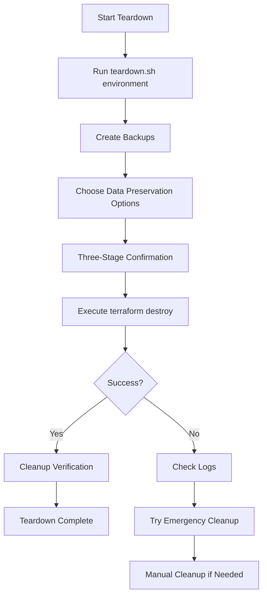
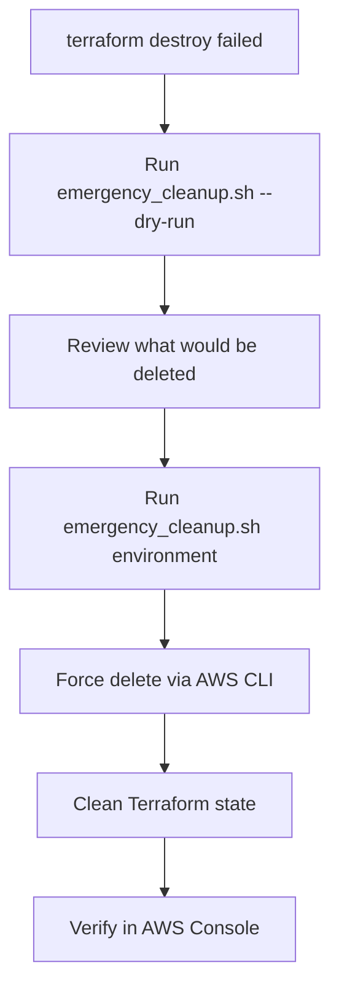
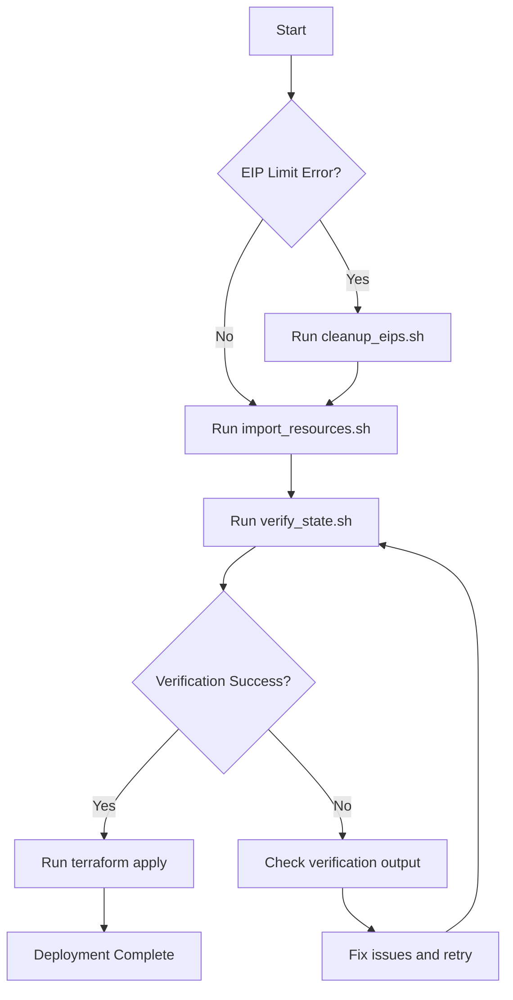

# Terraform Resource Import Guide for GAMCAPP

This guide documents the process for importing existing AWS resources into Terraform state when encountering "resource already exists" errors during deployment.

## Problem Statement

When running Terraform deployment for GAMCAPP production environment, you may encounter errors like:
- `BucketAlreadyOwnedByYou`: S3 buckets already exist
- `EntityAlreadyExists`: IAM roles already exist  
- `DBParameterGroupAlreadyExists`: RDS resources already exist
- `AddressLimitExceeded`: Hit Elastic IP address limit

These errors occur when AWS resources exist from previous deployment attempts, but Terraform doesn't know about them (they're not in the Terraform state).

## Solution Overview

We've created a comprehensive solution with five automated scripts:

1. **`scripts/import_resources.sh`** - Imports existing AWS resources into Terraform state
2. **`scripts/cleanup_eips.sh`** - Manages Elastic IP addresses and resolves EIP limits
3. **`scripts/verify_state.sh`** - Verifies Terraform state and AWS resource synchronization
4. **`scripts/teardown.sh`** - Safely destroys infrastructure when no longer needed
5. **`scripts/emergency_cleanup.sh`** - Emergency cleanup when Terraform destroy fails

## Quick Start

### Step 1: Fix PostgreSQL Version (Already Done)
The PostgreSQL version has been updated from "15.4" to "15.7" in `infrastructure/modules/rds/variables.tf`.

### Step 2: Handle EIP Limit (If Needed)
If you encounter EIP limit errors:
```bash
cd infrastructure
./scripts/cleanup_eips.sh --list
./scripts/cleanup_eips.sh --release-unused
```

### Step 3: Import Existing Resources
```bash
cd infrastructure
./scripts/import_resources.sh
```

### Step 4: Verify Everything Works
```bash
./scripts/verify_state.sh
```

### Step 5: Deploy
```bash
terraform apply -var-file="environments/prod/terraform.tfvars"
```

## Detailed Script Documentation

### 1. Import Resources Script (`scripts/import_resources.sh`)

**Purpose**: Imports existing AWS resources into Terraform state

**Features**:
- ✅ Safely imports resources (won't fail if already in state)
- ✅ Colored output for easy reading
- ✅ Comprehensive error handling
- ✅ Automatic AWS resource discovery
- ✅ Post-import verification with terraform plan

**Resources it imports**:
- S3 buckets (gamcapp-prod-eb-versions, gamcapp-prod-uploads)
- IAM roles (EB service, instance, CodeDeploy, VPC flow log roles)
- RDS components (subnet groups, parameter groups)
- Secrets Manager secrets
- CloudWatch log groups
- VPC resources (if they exist)
- ElasticBeanstalk applications (if they exist)

**Usage**:
```bash
./scripts/import_resources.sh
```

### 2. EIP Cleanup Script (`scripts/cleanup_eips.sh`)

**Purpose**: Manages Elastic IP addresses to resolve AWS EIP limits

**Features**:
- ✅ Lists all EIPs in the account
- ✅ Identifies unused (unassociated) EIPs
- ✅ Interactive or automated EIP release
- ✅ EIP limit checking and reporting
- ✅ Safe operation with confirmations

**Interactive Usage**:
```bash
./scripts/cleanup_eips.sh
```

**Command Line Usage**:
```bash
./scripts/cleanup_eips.sh --list                # List all EIPs
./scripts/cleanup_eips.sh --check               # Check EIP limits
./scripts/cleanup_eips.sh --release-unused      # Release unused EIPs
```

### 3. State Verification Script (`scripts/verify_state.sh`)

**Purpose**: Comprehensive verification of Terraform state and AWS resources

**Features**:
- ✅ Verifies Terraform initialization
- ✅ Checks AWS connectivity and permissions
- ✅ Lists current Terraform state
- ✅ Verifies expected resources are in state
- ✅ Runs terraform plan and analyzes output
- ✅ Checks for existing AWS resources
- ✅ Provides actionable recommendations

**Usage**:
```bash
./scripts/verify_state.sh                # Full verification
./scripts/verify_state.sh --state-only   # Check only Terraform state
./scripts/verify_state.sh --plan-only    # Run only terraform plan
./scripts/verify_state.sh --aws-only     # Check only AWS resources
```

### 4. Infrastructure Teardown Script (`scripts/teardown.sh`)

**Purpose**: Safely destroy infrastructure when no longer needed

**Features**:
- ✅ Multiple confirmation stages for safety
- ✅ Automatic data backup before destruction
- ✅ RDS snapshot creation options
- ✅ S3 data backup options
- ✅ Comprehensive resource cleanup verification
- ✅ Detailed logging and progress tracking
- ✅ Timeout handling for long operations

**Usage**:
```bash
./scripts/teardown.sh <environment> [options]

# Interactive teardown with safety prompts
./scripts/teardown.sh prod

# Show what would be destroyed (safe)
./scripts/teardown.sh dev --dry-run

# Skip confirmations (dangerous)
./scripts/teardown.sh staging --force

# Only create backups, don't destroy
./scripts/teardown.sh prod --backup-only
```

**Safety Features**:
- Three-stage confirmation (environment, project, "DESTROY")
- Automatic backup creation before destruction
- RDS final snapshot options
- S3 data download options
- 30-minute timeout protection
- Comprehensive logging

### 5. Emergency Cleanup Script (`scripts/emergency_cleanup.sh`)

**Purpose**: Force cleanup when Terraform destroy fails or gets stuck

**Features**:
- ✅ Direct AWS CLI resource deletion (bypasses Terraform)
- ✅ Handles stuck or partially destroyed resources  
- ✅ Cleans up resources in proper dependency order
- ✅ Dry-run mode for safety
- ✅ Resource discovery by naming patterns
- ✅ Comprehensive resource type coverage

**Usage**:
```bash
./scripts/emergency_cleanup.sh <environment> [options]

# Show what would be forcefully deleted (safe)
./scripts/emergency_cleanup.sh prod --dry-run

# Emergency force cleanup (last resort)
./scripts/emergency_cleanup.sh dev

# Clean up after failed terraform destroy
./scripts/emergency_cleanup.sh staging
```

**When to use**:
- When `terraform destroy` fails or hangs
- When resources are stuck in "deleting" state
- When Terraform state is corrupted
- As a last resort for cleanup

**⚠️ WARNING**: This script bypasses Terraform and may leave state inconsistent!

## Infrastructure Teardown Workflows

### Normal Teardown Process



### Emergency Cleanup Process



### Teardown Command Reference

**Safe Teardown (Recommended)**:
```bash
# Production teardown with all safety features
./scripts/teardown.sh prod

# Development teardown (faster, less confirmations)
./scripts/teardown.sh dev

# Check what would be destroyed without doing it
./scripts/teardown.sh staging --dry-run
```

**Emergency Teardown (When normal fails)**:
```bash
# See what emergency cleanup would do
./scripts/emergency_cleanup.sh prod --dry-run

# Force cleanup when terraform destroy is stuck
./scripts/emergency_cleanup.sh prod
```

**Data Preservation Options**:
- **RDS Data**: Create final snapshot or skip (data loss)
- **S3 Data**: Download to local backup or delete
- **Secrets**: Backed up as metadata (values not retrievable)
- **Logs**: Saved locally before deletion

## Troubleshooting Common Issues

### Issue 1: "Resource already exists" errors
**Solution**: Run the import script
```bash
./scripts/import_resources.sh
```

### Issue 2: EIP limit exceeded
**Solution**: Clean up unused EIPs
```bash
./scripts/cleanup_eips.sh --release-unused
```

### Issue 3: Resource configuration mismatch after import
**Cause**: Terraform configuration doesn't match actual AWS resource settings
**Solution**: Update Terraform files to match AWS resources, or use `terraform apply` to update resources

### Issue 4: Import fails with "resource not found"
**Cause**: The resource doesn't actually exist in AWS
**Solution**: Let Terraform create the resource normally

### Issue 5: AWS credentials or permissions issues
**Solution**: 
1. Check AWS credentials: `aws sts get-caller-identity`
2. Ensure the IAM role has comprehensive permissions (see main error resolution)

## File Changes Made

### 1. Fixed PostgreSQL Version
**File**: `infrastructure/modules/rds/variables.tf`
**Change**: Updated `db_engine_version` default from "15.4" to "15.7"

### 2. Created Scripts
**Files Created**:
- `infrastructure/scripts/import_resources.sh`
- `infrastructure/scripts/cleanup_eips.sh`  
- `infrastructure/scripts/verify_state.sh`

All scripts are executable (`chmod +x`) and include:
- Comprehensive error handling
- Colored output for readability
- Command-line options for automation
- Interactive menus for ease of use

## Execution Flow



## Alternative Approaches

If the import approach doesn't work for your situation:

### Option 1: Clean Slate Approach
1. Manually delete all existing AWS resources in the Console
2. Run fresh `terraform apply`

### Option 2: Targeted Resource Management
```bash
# Remove specific resources from state
terraform state rm module.elasticbeanstalk.aws_s3_bucket.eb_versions

# Force replacement of specific resources
terraform apply -replace="module.iam.aws_iam_role.eb_service_role"
```

## Best Practices for Future Deployments

1. **Always use Terraform for resource management** - Don't create resources manually in AWS Console
2. **Maintain Terraform state** - Use remote state backends (S3 + DynamoDB)
3. **Use workspaces or separate state files** for different environments
4. **Run `terraform plan`** before `terraform apply` to preview changes
5. **Keep Terraform configurations in version control**

## Support and Recovery

If you encounter issues with these scripts:

1. Check the generated log files (e.g., `plan_output.txt`, `verification_plan.txt`)
2. Verify AWS permissions are sufficient
3. Use the verification script to diagnose issues
4. Manual resource cleanup in AWS Console as last resort

All scripts include comprehensive logging and error reporting to help diagnose and resolve issues quickly.

## Script Safety Features

- **Dry-run capabilities**: Verification script shows what would happen
- **Confirmation prompts**: Destructive operations require confirmation  
- **Rollback information**: Clear guidance on how to undo changes
- **Incremental execution**: Scripts can be run multiple times safely
- **Detailed logging**: All operations are logged for troubleshooting