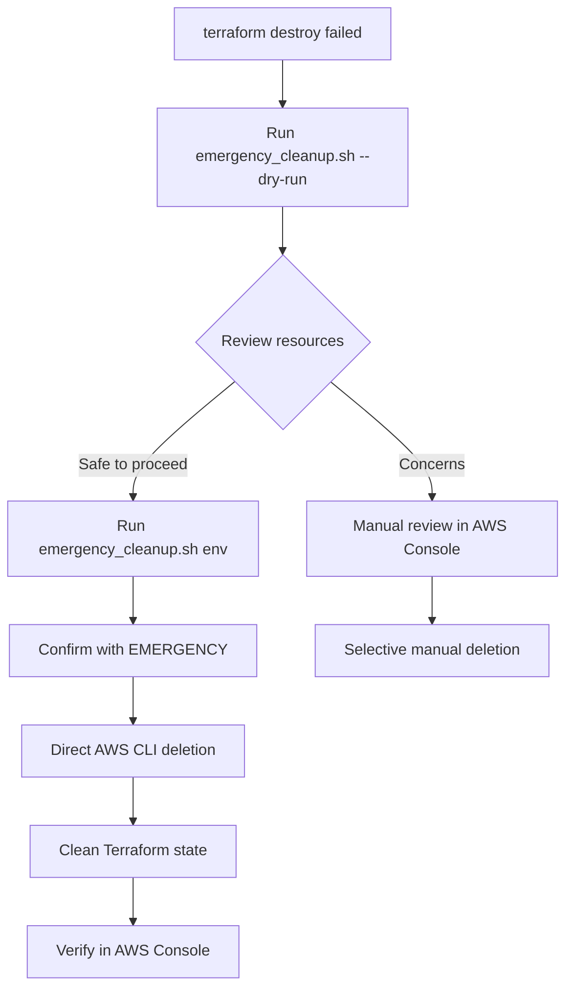

# Infrastructure Teardown Guide for GAMCAPP

This guide documents the process for safely destroying AWS infrastructure when it's no longer needed, along with emergency cleanup procedures when normal teardown fails.

## 🎯 Quick Reference

| Scenario | Command | Description |
|----------|---------|-------------|
| **Safe Teardown** | `./scripts/teardown.sh prod` | Full teardown with backups and confirmations |
| **Preview Changes** | `./scripts/teardown.sh prod --dry-run` | Show what would be destroyed (safe) |
| **Backup Only** | `./scripts/teardown.sh prod --backup-only` | Create backups without destroying |
| **Emergency Cleanup** | `./scripts/emergency_cleanup.sh prod --dry-run` | Preview emergency cleanup |
| **Force Cleanup** | `./scripts/emergency_cleanup.sh prod` | When terraform destroy fails |

## 🛠 Available Scripts

### 1. Main Teardown Script (`scripts/teardown.sh`)

**Purpose**: Safe, comprehensive infrastructure destruction with data protection

**Key Features**:
- ✅ Three-stage confirmation process
- ✅ Automatic backup creation
- ✅ RDS snapshot options
- ✅ S3 data preservation
- ✅ Progress tracking with timeouts
- ✅ Post-destruction verification

**Usage Examples**:
```bash
# Interactive production teardown (recommended)
./scripts/teardown.sh prod

# Development teardown
./scripts/teardown.sh dev

# Preview what would be destroyed (safe)
./scripts/teardown.sh staging --dry-run

# Skip all confirmations (dangerous)
./scripts/teardown.sh dev --force

# Create backups only, don't destroy
./scripts/teardown.sh prod --backup-only
```

### 2. Emergency Cleanup Script (`scripts/emergency_cleanup.sh`)

**Purpose**: Force cleanup when Terraform destroy fails or gets stuck

**Key Features**:
- ⚠️ Bypasses Terraform (uses AWS CLI directly)
- ✅ Handles stuck/corrupted resources
- ✅ Proper dependency order deletion
- ✅ Dry-run mode for safety
- ✅ Resource pattern matching

**Usage Examples**:
```bash
# See what would be forcefully deleted (safe)
./scripts/emergency_cleanup.sh prod --dry-run

# Emergency cleanup when terraform destroy fails
./scripts/emergency_cleanup.sh prod

# Clean up after partial destruction
./scripts/emergency_cleanup.sh staging
```

## 📋 Step-by-Step Teardown Process

### Option A: Normal Teardown (Recommended)

```bash
# Step 1: Navigate to infrastructure directory
cd infrastructure

# Step 2: Preview the destruction plan
./scripts/teardown.sh prod --dry-run

# Step 3: Review the plan output
# Check what will be destroyed and confirm it's what you want

# Step 4: Execute safe teardown
./scripts/teardown.sh prod

# Step 5: Follow the prompts:
# - Data preservation options (RDS snapshots, S3 backups)
# - Three-stage confirmation
# - Monitor progress (can take 10-30 minutes)

# Step 6: Verify completion
# Script will show summary and check for remaining resources
```

### Option B: Emergency Cleanup (When Normal Fails)

```bash
# Step 1: Try emergency cleanup preview first
./scripts/emergency_cleanup.sh prod --dry-run

# Step 2: Review what would be deleted
# This uses AWS CLI directly, bypassing Terraform

# Step 3: Execute emergency cleanup
./scripts/emergency_cleanup.sh prod

# Step 4: Confirm with "EMERGENCY"
# This is the final safety check

# Step 5: Monitor progress
# Resources are deleted directly via AWS CLI

# Step 6: Clean up Terraform state manually
terraform state list  # See what's left in state
terraform state rm <resource_address>  # Remove stale entries
```

## 🔒 Safety Features

### Data Protection
- **RDS Databases**: Option to create final snapshots before deletion
- **S3 Buckets**: Option to download all files locally before deletion
- **Secrets Manager**: Metadata backed up (secret values cannot be retrieved)
- **CloudWatch Logs**: Exported before deletion
- **Terraform State**: Backed up locally

### Confirmation Process
The teardown script requires three confirmations to prevent accidents:

1. **Environment Name**: Type the environment name (e.g., "prod")
2. **Project Name**: Type the project name (e.g., "gamcapp")  
3. **Final Confirmation**: Type "DESTROY" in capital letters

### Progress Monitoring
- Real-time status updates
- Comprehensive logging to files
- 30-minute timeout protection
- Graceful handling of interruptions

## 📊 What Gets Destroyed

### Infrastructure Components
- **VPC**: All networking (subnets, gateways, security groups)
- **RDS**: Database instances, snapshots, parameter groups
- **ElasticBeanstalk**: Applications and environments
- **S3**: Buckets and all contents
- **IAM**: Roles, policies, instance profiles
- **CloudWatch**: Log groups and metrics
- **Secrets Manager**: All secrets and versions
- **EIPs**: Unattached Elastic IP addresses

### Backup Locations
Backups are created in `/tmp/gamcapp_backup_<env>_<timestamp>/`:
- Terraform state files
- Environment configurations  
- Resource metadata and lists
- S3 bucket contents (if selected)

## 🚨 Troubleshooting Teardown Issues

### Issue 1: Terraform destroy hangs or times out
**Solution**: Use emergency cleanup
```bash
./scripts/emergency_cleanup.sh prod --dry-run
./scripts/emergency_cleanup.sh prod
```

### Issue 2: Dependencies prevent resource deletion
**Symptoms**: "DependencyViolation" errors
**Solution**: Emergency script deletes in proper order
```bash
./scripts/emergency_cleanup.sh prod
```

### Issue 3: Some resources won't delete
**Symptoms**: Resources stuck in "deleting" state
**Solutions**:
1. Wait 10-15 minutes and try again
2. Use emergency cleanup script
3. Manual deletion in AWS Console

### Issue 4: Permission errors during teardown
**Symptoms**: "Access denied" or "Not authorized"
**Solution**: Verify IAM permissions include:
- Full access to all resource types
- `iam:DeleteRole`, `s3:DeleteBucket`, `rds:DeleteDBInstance`, etc.

### Issue 5: Terraform state becomes inconsistent
**After emergency cleanup, state may be out of sync**
**Solution**:
```bash
# List remaining state entries
terraform state list

# Remove stale entries
terraform state rm module.vpc.aws_vpc.main
terraform state rm module.rds.aws_db_instance.main

# Or reinitialize completely
rm -rf .terraform terraform.tfstate*
terraform init
```

## ⚡ Emergency Scenarios

### When to Use Emergency Cleanup

1. **Terraform destroy fails repeatedly**
2. **Resources are stuck in intermediate states**
3. **Terraform state is corrupted**
4. **Normal teardown process is interrupted**
5. **AWS Console shows resources that Terraform can't see**

### Emergency Cleanup Process



## 📝 Post-Teardown Checklist

### Immediate Steps
- [ ] Verify all resources deleted in AWS Console
- [ ] Check for unexpected charges in AWS Billing
- [ ] Update DNS records if they pointed to deleted resources
- [ ] Remove backup files when no longer needed
- [ ] Clean up Terraform state directory

### Documentation Updates
- [ ] Update deployment documentation
- [ ] Remove environment from CI/CD pipelines
- [ ] Update monitoring and alerting configurations
- [ ] Inform team members of teardown completion

### Security Cleanup
- [ ] Revoke any temporary access keys
- [ ] Remove IAM users/roles specific to this environment
- [ ] Update security group references in other environments
- [ ] Review and update backup retention policies

## 🔍 Verification Commands

After teardown, use these commands to verify complete cleanup:

```bash
# Check for remaining S3 buckets
aws s3 ls | grep gamcapp

# Check for remaining RDS instances
aws rds describe-db-instances --query "DBInstances[?contains(DBInstanceIdentifier, 'gamcapp')]"

# Check for remaining IAM roles
aws iam list-roles --query "Roles[?contains(RoleName, 'gamcapp')]"

# Check for remaining ElasticBeanstalk applications
aws elasticbeanstalk describe-applications --query "Applications[?contains(ApplicationName, 'gamcapp')]"

# Check for remaining VPCs (may take longer to show up)
aws ec2 describe-vpcs --filters "Name=tag:Name,Values=*gamcapp*"
```

## 📞 Getting Help

If you encounter issues not covered in this guide:

1. **Check log files**: All scripts create detailed logs in the infrastructure directory
2. **Review AWS CloudTrail**: See what API calls were made during teardown
3. **Use AWS Support**: For stuck resources or billing questions
4. **Check script output**: All scripts provide detailed status and error messages

## ⚠️ Important Warnings

- **Data Loss**: Teardown permanently deletes all data unless explicitly backed up
- **Irreversible**: Once destroyed, resources cannot be restored (except from backups)
- **State Consistency**: Emergency cleanup may leave Terraform state inconsistent
- **Cost Impact**: Some resources (like RDS snapshots) may continue incurring costs
- **Dependencies**: Other environments may depend on shared resources (IAM roles, etc.)

---

**Remember**: Always run with `--dry-run` first to see what will be destroyed before executing actual teardown!